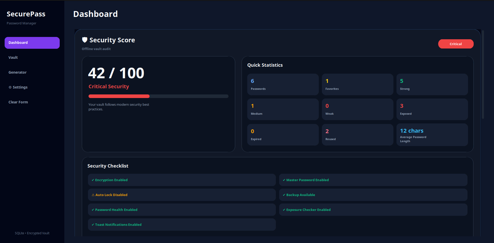
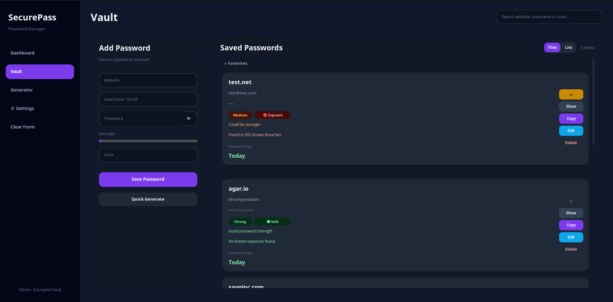
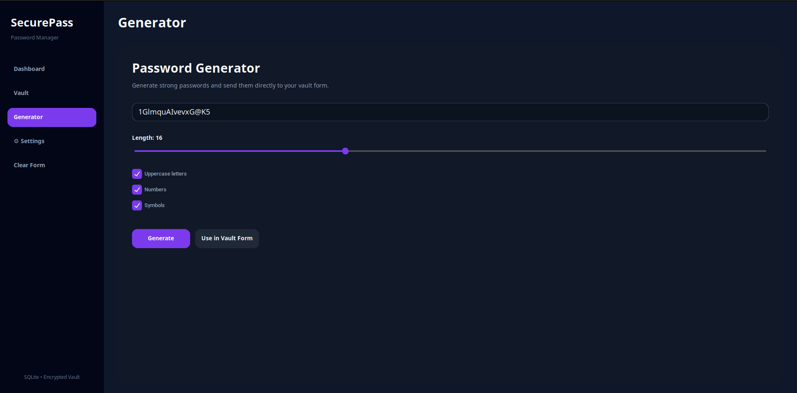
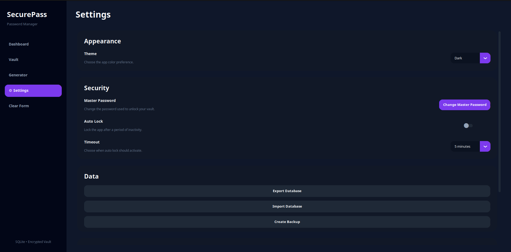

# 🔐 SecurePass

<div align="center">

### A Modern Desktop Password Manager Built with Python

Secure • Offline • Encrypted • Beautiful


</div>

---

# 📖 About

SecurePass is a modern desktop password manager focused on security, privacy, and usability.

Unlike browser-based password managers, SecurePass stores your encrypted vault locally using SQLite and Fernet encryption while providing a modern desktop experience built with CustomTkinter.

The application includes password health analysis, password exposure checking, automatic security auditing, favorites, themes, dashboard analytics, backup tools, and many more features.

---

# ✨ Features


## 🔒 Security

* Master Password Authentication
* Fernet Encryption
* Password Health Analysis
* Password Exposure Checker (Have I Been Pwned)
* Reused Password Detection
* Password Expiration Warnings
* Automatic Security Score
* Auto Lock
* Offline First

---

## 📊 Dashboard

* Security Score
* Password Statistics
* Strong / Medium / Weak Analysis
* Reused Password Overview
* Exposed Password Overview
* Recently Updated Passwords
* Password Age

---

## 🎲 Password Generator

Generate secure passwords with configurable options.

Features include:

* Custom Length
* Numbers
* Symbols
* Uppercase
* Lowercase
* Password Strength Indicator

---

## ⚙ Settings

* Dark/Light Theme
* Auto Lock
* Backup
* Import
* Export

---

# 📸 Screenshots

## Dashboard

<p align="center">
  
</p>

---

## Vault

<p align="center">
  
</p>

---

## Password Generator

<p align="center">
  
</p>

---

## Settings

<p align="center">
  
</p>

---

# 🛡 Security

SecurePass was designed with security as the highest priority.

### Password Storage

- Passwords are encrypted using Fernet symmetric encryption.
- Passwords are never stored in plain text.
- An encryption key is derived from the Master Password.
- The vault can only be decrypted after successful Master Password verification.

### Password Exposure Check

SecurePass integrates with the **Have I Been Pwned Passwords API** using the **k-Anonymity model**.

This means:

* Your actual password is **never sent**.
* The complete SHA-1 hash is **never sent**.
* Only the first five characters of the SHA-1 hash are transmitted.

---

# 📈 Security Audit

SecurePass continuously analyzes your vault.

The Security Audit includes:

* Weak/Medium Password Detection
* Reused Password Detection
* Password Exposure Detection
* Security Score
* Recommendations for improving your vault

Everything runs **locally** except optional password exposure checks.

---

# 🛠 Tech Stack

| Technology            | Purpose                    |
| --------------------- | -------------------------- |
| Python                | Core Application           |
| CustomTkinter         | Modern Desktop UI          |
| SQLite                | Local Database             |
| Fernet                | Password Encryption        |
| hashlib               | Password Hashing           |
| Have I Been Pwned API | Password Exposure Checking |

---

# 🚀 Installation

Clone the repository:

```bash
git clone https://github.com/ElmaYiyenAdam/SecurePass.git
```

Go into the project:

```bash
cd SecurePass
```

Install dependencies:

```bash
pip install -r requirements.txt
```

Run:

```bash
python main.py
```

---

# 🗺 Roadmap

## ✅ Completed

* Dashboard
* Password Generator
* Password Health
* Password Exposure Checker
* Favorites
* Toast Notifications
* Modern Settings
* Import / Export
* Backup
* Auto Lock
* Theme Switching
* Change Master Password
* Password Expiration
* Security Audit

---

## 🚧 Planned

* Browser Extension
* Mobile Companion App
* Secure Cloud Sync
* Biometric Authentication
* Password Sharing

---

# 🤝 Contributing

Contributions, issues, and feature requests are welcome.

Feel free to open an issue or submit a pull request.

---

# 📄 License

This project is licensed under the MIT License.

---

<div align="center">

### ⭐ If you like this project, consider giving it a star!

Made with ❤️ using Python

</div>
